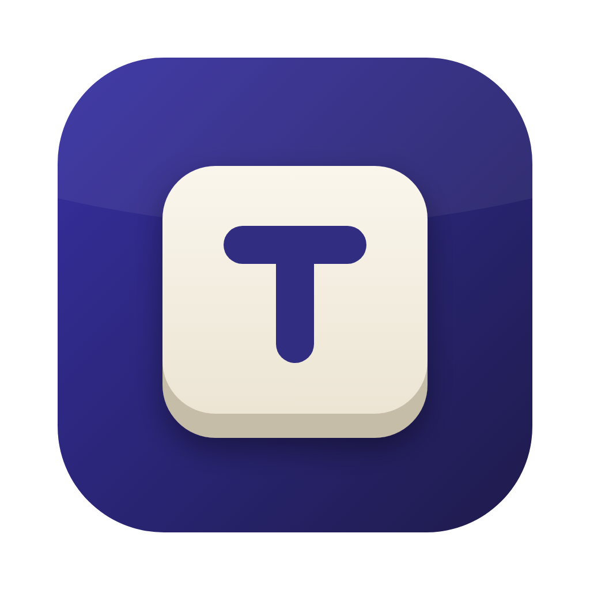
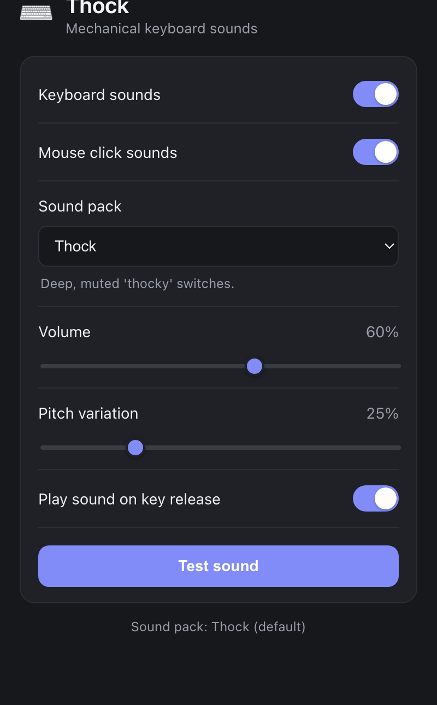

<div align="center">



# 🎹 Thock — Mechanical Keyboard Sound Simulator

**Every keystroke, satisfying. System-wide, cross-platform, zero latency.**

[](https://github.com/ArahKarya/thock)
[](LICENSE)
[](https://www.rust-lang.org)
[](https://tauri.app)
[](src-tauri/sounds/)
[](https://github.com/ArahKarya/thock/releases)
[](https://github.com/ArahKarya/thock/releases/latest)

</div>

> Produk **Arah Karya Sinergi (AKS)**. Original, clean-room — not affiliated with any other keyboard-sound application.

Thock is a lightweight system-tray utility that intercepts global keystrokes and plays **mechanically satisfying sounds** — built on Tauri 2 (Rust backend + web UI). It ships **4 synthesized sound packs** (Thock, Clicky, Tactile, Typewriter), supports mouse-click sounds, and persists your settings to the OS config directory. All bundled audio is **CC0 — procedurally generated** from scratch, containing no third-party samples.

Designed to be pluggable: bring your own sound packs via a simple JSON manifest.

## 📸 Tampilan

<div align="center">

<br/>
<sub>Settings window — toggles, sound-pack picker, volume &amp; pitch controls. Lives in the system tray.</sub>
</div>

## ✨ Why Thock

| Problem | Solution |
|---|---|
| Membrane keyboards feel dead | Global hook plays satisfying WAV on every keystroke — system-wide |
| Sound packs use proprietary/ripped audio | All bundled audio CC0, procedurally synthesized via `tools/gen_sounds.py` |
| One-size-fits-all sound | 4 distinct pack profiles + live switching from tray |
| Overlapping keys sound wrong | Audio thread uses rodio mixing — rapid keystrokes never cut each other off |
| Annoying auto-repeat clicks | Held-key tracking filters repeated events — only first press sounds |

## 🏛️ Architecture

```
src/                     Web UI (vanilla TypeScript + Vite)
src-tauri/
  src/
    lib.rs               Tauri app: tray, window, IPC commands, wiring
    listener.rs          Global key hook (rdev) — dedicated thread, blocking
    audio.rs             Audio output thread (rodio) — overlapping click mixing
    soundpack.rs         Pack manifest model + embedded default pack
    state.rs             Shared state: maps key events → playback
    keymap.rs            OS key code → logical pack key name
    config.rs            Persisted settings (load / save)
  sounds/
    thock/               Default pack (Thock — deep, muted, procedural)
    clicky/              Clicky pack
    tactile/             Tactile pack
    typewriter/          Typewriter pack
tools/
  gen_sounds.py          Regenerates all bundled packs (stdlib only, no deps)
```

**Threading model:** listener on its own thread (OS hooks are blocking) → audio on its own thread (rodio `!Send`) → short WAVs decoded per-press and mixed.

## 🔁 Sound Pack Format

Each pack lives in `src-tauri/sounds/<pack-name>/` with a `pack.json` manifest:

```json
{
  "name": "Thock",
  "license": "CC0-1.0",
  "version": "1.0.0",
  "default": { "press": "key_press.wav", "release": "key_release.wav" },
  "keys": {
    "Space":     { "press": "space_press.wav",    "release": "space_release.wav" },
    "Enter":     { "press": "enter_press.wav",    "release": "enter_release.wav" },
    "Backspace": { "press": "backspace_press.wav" },
    "Shift":     { "press": "modifier_press.wav" },
    "MouseLeft": { "press": "mouse_press.wav",    "release": "mouse_release.wav" }
  }
}
```

See [`src-tauri/sounds/README.md`](src-tauri/sounds/README.md) for the full spec.

## 📁 Repo Structure

```
thock/
├── src/                   # Web UI (TypeScript + Vite)
├── src-tauri/
│   ├── src/               # Rust backend (6 modules)
│   ├── sounds/            # Bundled sound packs (CC0)
│   ├── capabilities/      # Tauri permission manifest
│   └── tauri.conf.json    # App config (identifier, window, tray)
├── tools/
│   └── gen_sounds.py      # Sound pack generator (Python stdlib)
├── design/
│   ├── icon.svg            # Master app icon (SVG source)
│   └── icon-1024.png       # Exported 1024×1024 PNG
├── package.json
└── vite.config.ts
```

## 📦 Download

Pre-built binaries are published automatically on every tagged release via GitHub Actions.
Download the latest build from the [**Releases page**](https://github.com/ArahKarya/thock/releases/latest):

| Platform | Format |
|---|---|
| macOS (Apple Silicon) | `.dmg` (aarch64) |
| macOS (Intel) | `.dmg` (x86_64) |
| Linux | `.deb` · `.AppImage` · `.rpm` |
| Windows | `.msi` · `-setup.exe` |

> **macOS/Linux note:** grant Input Monitoring (macOS) or run under X11 / add user to `input` group (Linux) for global key capture — see [Permissions](#-permissions) below.

## 🚀 Quickstart

### Prerequisites

- [Rust](https://www.rust-lang.org/tools/install) (stable)
- [Node.js](https://nodejs.org) + [pnpm](https://pnpm.io)
- Platform toolchains:
  - **macOS**: Xcode Command Line Tools
  - **Linux** (Debian/Ubuntu):
    ```bash
    sudo apt install libwebkit2gtk-4.1-dev build-essential libasound2-dev \
                     libx11-dev libxi-dev libxtst-dev \
                     libayatana-appindicator3-dev librsvg2-dev patchelf
    ```
  - **Windows**: WebView2 (pre-installed on Win 11) + MSVC build tools

### Dev

```bash
pnpm install
pnpm tauri dev
```

### Build release bundle

```bash
pnpm tauri build
# Artifacts → src-tauri/target/release/bundle/
# macOS: .dmg / .app   Linux: .deb / .AppImage / .rpm   Windows: .msi / .exe
```

### Regenerate sound packs

```bash
python3 tools/gen_sounds.py src-tauri/sounds            # all packs
python3 tools/gen_sounds.py src-tauri/sounds typewriter # one pack
```

## 🔒 Permissions

Global key capture requires OS permission:

| Platform | Requirement |
|---|---|
| **macOS** | Grant **Input Monitoring** (+ Accessibility) in *System Settings → Privacy & Security*. In dev, grant to your terminal. |
| **Linux** | X11: works out of the box. Wayland: global capture restricted — user may need `input` group for `/dev/input`. |
| **Windows** | No extra permission needed. |

## ✅ Status

- [x] Global keystroke listener (rdev, dedicated thread)
- [x] Audio mixing with overlapping-key support (rodio)
- [x] Auto-repeat suppression
- [x] 4 bundled CC0 sound packs (Thock, Clicky, Tactile, Typewriter)
- [x] Mouse click sounds (left / right / middle), separately toggleable
- [x] Volume + random pitch-variation controls
- [x] Key-release sounds (optional)
- [x] Distinct sounds: Space / Enter / Backspace / modifiers
- [x] System tray menu (pack picker, toggles, settings, quit)
- [x] Config persisted to OS config directory
- [x] Pluggable JSON sound-pack format
- [x] CI/CD release workflow (GitHub Actions — auto-build on tag)
- [x] Pre-built binaries (`.dmg` / `.deb` / `.AppImage` / `.rpm` / `.msi` / `.exe`)
- [x] Settings UI
- [ ] More bundled packs

## 🧱 Stack

| Layer | Technology |
|---|---|
| Backend | Rust (stable), Tauri 2 |
| Global hook | rdev |
| Audio | rodio |
| UI | TypeScript, Vite (vanilla) |
| Build | pnpm, cargo |
| Audio generation | Python 3 (stdlib only) |

## Licensing & Provenance

- **Code**: [MIT](LICENSE)
- **Bundled audio**: CC0-1.0 — procedurally generated by `tools/gen_sounds.py`, no third-party samples
- Thock is a from-scratch implementation — not decompiled from, and does not copy code, sounds, icons, or branding from, any other application. Only the general concept of "play a sound on keypress" is shared, which is not protectable by copyright.

## Contributing

Keep it clean-room: only original or CC0 assets, no code copied from proprietary sources.

```bash
cargo fmt && cargo clippy   # before submitting
```

---

<div align="center">
<sub>© 2026 Arah Karya Sinergi (AKS)</sub>
</div>
